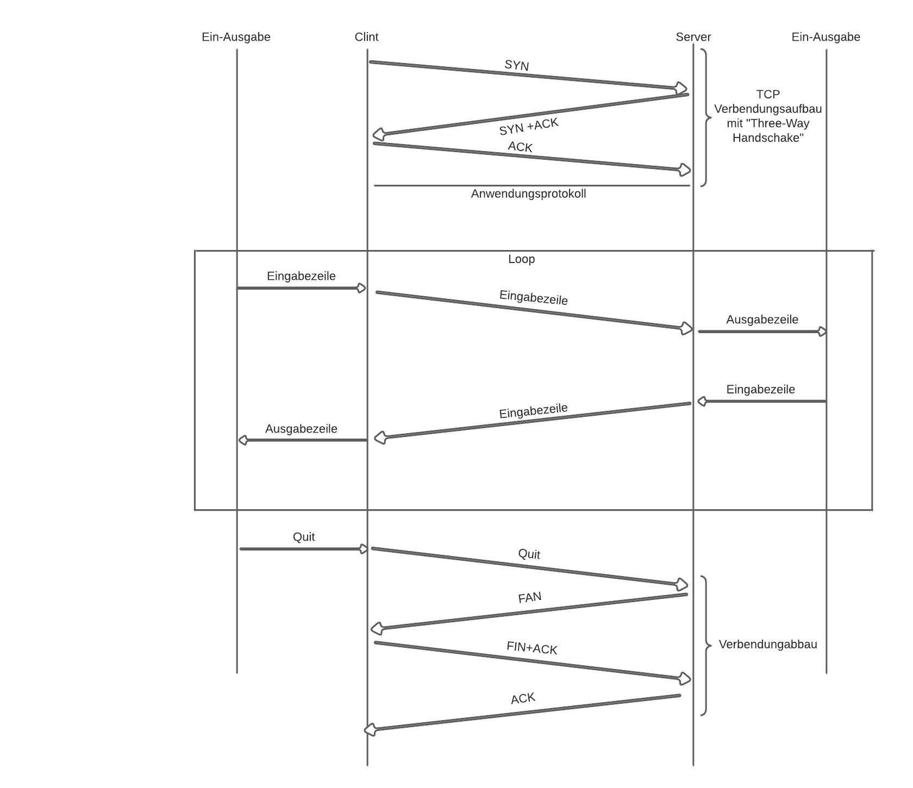

# Simple_Chat
<h3>Ablaufdiagramm für die kommenikation zwischen Clint und Server :</h3>

<h3>Starten:</h3>
<h3>
    <ul>
    <li>Starte Anwendung</li>
    <li>Clint ruft Server "Localhost port:2023"</li>
    </ul>
</h3>